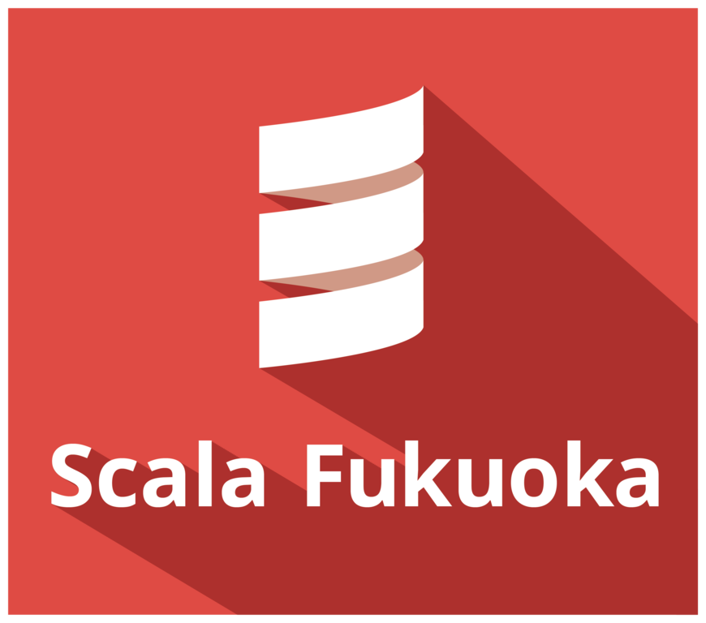

# FUKUOKA Engineers Day とは

- **福岡** のエンジニアによる
- **福岡** のエンジニアのためのイベント
- **普段** のこと、 **チャレンジ中** のこと
- **昔** のこと、 **将来** のこと
- 思いっきり **アウトプット** してみませんか？

「福岡でチャレンジしている人をピックアップする」ことを目標に、「福岡のエンジニアのためのイベント」として過去5回にわたり開催しました。

- [[全レポートまとめ] 福岡のエンジニアによる大文化祭、 FUKUOKA Engineers Day 2018 を開催しました #edayfuk](https://dev.classmethod.jp/study_meeting/fukuoka-engineers-day-2018-all-sessions/)
- [[全レポートまとめ] 福岡のエンジニアの大文化祭 FUKUOKA Engineers Day 2019 ~Summer~ を開催しました #edayfuk](https://dev.classmethod.jp/articles/edayfuk2019-allreport/)
- [FUKUOKA Engineers Dayを開催しました](https://matcu.hatenablog.com/entry/2019/07/21/213520)

前回と同様、 **「福岡のコミュニティでアウトプットしているエンジニア」** に注目しました。

今回は昨今の情勢を鑑み、オンラインでの開催を予定しています。

福岡の各コミュニティに **コミュニティスポンサー** という形式でご協力いただき、セッションの1枠（15分）を担当していただきます。

**全 16 のコミュニティ** が一堂に会し、技術セッションを行う濃厚なイベントになる予定です。

是非ご参加ください！

# 開催要項

## 日時

- 2021年4月24日（土） 13:00～20:00

## 会場

- 場所: [エンジニアカフェ](https://engineercafe.jp/ja/)（配信拠点としての利用）
  - 登壇者は各自の自宅から配信
  - 自宅からの配信が困難な場合は [エンジニアカフェ](https://engineercafe.jp/ja/) より登壇できます
- 配信ツール
  - Zoom（予定）
  - Youtube Live （予定）

## 参加費

- 無料
# タイムテーブル

| 開始時間 | 終了時間 | 時間 | セッション | 登壇者 |
| --- | --- | --- | --- | --- |
| 13:00 | 13:10 | 0:10 | オープニング | |
| 13:10 | 13:30 | 0:20 | 基調講演 | |
| 13:30 | 13:40 | 0:10 | 休憩 | |
| 13:40 | 14:00 | 0:20 | コミュニティスポンサー | |
| 14:00 | 14:20 | 0:20 | コミュニティスポンサー | |
| 14:20 | 14:40 | 0:20 | コミュニティスポンサー | |
| 14:40 | 14:50 | 0:10 | 休憩 | |
| 14:50 | 15:10 | 0:20 | コミュニティスポンサー | |
| 15:10 | 15:30 | 0:20 | コミュニティスポンサー | |
| 15:30 | 15:50 | 0:20 | コミュニティスポンサー | |
| 15:50 | 16:00 | 0:10 | 休憩 | |
| 16:00 | 16:20 | 0:20 | コミュニティスポンサー | |
| 16:20 | 16:40 | 0:20 | コミュニティスポンサー | |
| 16:40 | 17:00 | 0:20 | コミュニティスポンサー | |
| 17:00 | 17:10 | 0:10 | 休憩 | |
| 17:10 | 17:30 | 0:20 | コミュニティスポンサー | |
| 17:30 | 17:50 | 0:20 | コミュニティスポンサー | |
| 17:50 | 18:10 | 0:20 | コミュニティスポンサー | |
| 18:10 | 18:20 | 0:10 | 休憩 | |
| 18:20 | 18:40 | 0:20 | コミュニティスポンサー | |
| 18:40 | 19:00 | 0:20 | コミュニティスポンサー | |
| 19:00 | 19:20 | 0:20 | コミュニティスポンサー | |
| 19:20 | 19:40 | 0:20 | コミュニティスポンサー | |
| 19:40 | 20:00 | 0:20 | 撤収 | |
# ゲストセッション

- [yohey](https://yoheikoga.github.io/) さん

# コミュニティスポンサー（セッション枠）

## [福岡XR部](https://fukuoka-xr-club.connpass.com/)

福岡XR部は福岡でVR/AR/MRといったXR技術や表現に興味があるメンバーが集まるコミュニティです。 同じ興味を持つメンバーが部室に集まってわいわいディスカッションしたり教えあったりする雰囲気をイメージして、ミートアップやXRコンテンツを体験したり実験したり、最近はオンライン中心にVRの中でイベントを開催したりもしています。

## [Scala福岡](https://scala.connpass.com/)

Scala福岡は、Scalaを福岡・九州で盛り上げていきたい、まずはイベントやってみようじゃないか。 ということで2016年から始まりました。これまで3回の100名規模のイベントを開催し、Scalaを広げたいという思いから、毎回ハンズオンなどの初学者向けコンテンツを準備するなどといった工夫をしています。またScala福岡とは直接関係ありませんが、コミュニティメンバーによって「サルでもわかるScala」という少人数での勉強会を、これまで隔週で70回ほど開催しています。
2020年12月より、Discordを使ったオンラインでのもくもく会を毎週火曜日の19:00~21:00で行っております。

## [Javaコミュ＠福岡](https://javaq.connpass.com/)

Javaコミュ＠福岡は、JavaやJVMに関するイベントを年に数回行うコミュニティです。オンラインではあまり活動できていませんが、物理イベントが可能になったら またイベントやっていきたいと思っています。

## [VUI Fukuoka](https://vuifukuoka.connpass.com/)

Amazon Echo(Alexa)、LINE Clova、Google Homeなど
VUIに関する情報交換の場にしたいと思います。
ハンズオンからもくもく会までやっていきます。

## [SORACOM UG九州](https://pages.soracom.jp/usergroup.html)

SORACOM User Groupは、IoTプラットフォーム「SORACOM」の情報を知りたい人、使ってみたい人、使っている人、より良い使い方を知りたい人は誰でも参加出来るコミュニティです。
その九州支部である「SORACOM UG九州」は、3ヶ月に1回程度、九州各地でセミナーやハンズオンを行っています。SORACOMのサービスやIoTに興味のある方は是非ご参加下さい！

## ARコンテンツ作成勉強会

TBD

## [女子だらけの電子工作](https://jyoshidarake.connpass.com/)

電子工作やIoTの勉強会は男性ばかりで、女子は参加し辛い・・・ という声から活動を開始し、女性やお子さんが、安心できて、ゆるりと電子工作を楽しめる場所になればと活動をしてきました。最近は、オンライン開催ということで、老若男女、可愛い電子工作に興味がある方は、どなたでも参加することができます。初心者大歓迎！一緒に楽しみましょう！

## LINE Developer Group Q-shu

TBD

## Fukuoka.go

TBD

## [FukuokaJS](https://fukuokajs.connpass.com/)

フロントエンドからバックエンドまで一貫して記述出来るJavascript。はたまた、3Dコンテンツや、デスクトップアプリ、ネイティブアプリまで。　幅広いがゆえに、いろんな人が使っているJavascriptです。

定期的にJS関連の技術を使うエンジニア／デザイナ／◯◯◯(職業問わず)が集まり、気軽にコミュニケーション出来ればよいなぁと思いコミュニティーを運営しています。 JSは、UI / アニメーション / バックエンド / Webアプリフレームワーク / ネイティブアプリ　などなど、様々な事に関連します。 この場でJSの輪が広がっていくよう願いを込めています。

## [ゆるっとIT](https://yurutto-it.connpass.com/)

TBD

## FUKUOKA NIWAKA

TBD

## [GBEC Park](https://gbec.connpass.com/)

GBEC Parkは福岡のブロックチェーンに関わる技術者が集まるコミュニティです。
ブロックチェーンへの興味・関心があれば誰でも参加可能です。
2018年より『福岡ブロックチェーン勉強会・もくもく会』を隔週で開催しています。オンラインでの開催ですので、全国どこからでも参加可能です。
# 行動規範: Code of Contact

## １．目的

[FUKUOKA Engineers Day](https://engineers-day.connpass.com/)（以降、当団体）は、なによりも福岡を愛するエンジニアの皆様のためのコミュニティであるべきだと考えます。

このため、私たちは誰に対しても安全で快適な環境を提供できるよう尽力します。

この行動規範では、参加者・登壇者の行動に求めることと、受け入れがたい行為が招く結果について要点をまとめています。

すべての参加者の皆様が、誰にとっても安全で快い体験ができる場所を実現するために協力してくれることを希望します。

## ２．もっとたくさんの福岡の「スゴイ」を増やしたい

この行動規範のもうひとつのゴールは、もっとたくさんの福岡のエンジニアに対外での活動を増やしてもらうことです。

当団体は、より多くの方々に活動内容を知ってもらうほか、各地域のエンジニアに対して福岡への渡航機運を高めていただき、多くのメンターとの出会いの機会を創出することを目指しています。

このゴールを達成するために、当団体ではイベントに関わる様々な情報の共有のほか、この活動を通して多くの方に携わっていただけるような場を創出いたします。

## ３．宣言

- 当団体は、特定の企業の利益のために活動しません
- 当団体は、参加者の皆様へ過度な金銭の負担を行いません
- 当団体は、参加者・登壇者の皆様へのリスペクトを忘れません

## ４. 求められる行動

参加者・登壇者の皆様へ、お互いへのリスペクトを忘れず、行動規範に従って行動していただけることを期待します。

## ５. 受け入れがたい行為

### 「受け入れがたい行為」には以下が含まれます。

- 当団体の運営するイベントにおける参加者による威嚇的・迷惑・虐待的・差別的・軽蔑的・屈辱的な行為
- 特定の技術・団体への誹謗中傷

### 「迷惑行為」には以下が含まれます。

- 性別・性的指向・人種・宗教・障害に関する攻撃的な口頭のコメント
- プレゼンスライドを含む公的空間においての裸体や性的画像の不適切な使用
- 本人の許諾を取っていない写真撮影や録音
- プレゼンその他のイベントに対する継続的な妨害
- 不適切な身体的接触
- 歓迎されていない性的な注目

## ６. 受け入れがたい行為を目にした場合・その被害を被った場合

もし自身が受け入れがたい行為にさらされたり、誰かがそのような行為を受けていたり、その他気になることがあったりした場合は、できるだけ早く当団体の運営者にお知らせください。

運営者は、参加者が会場の警備員や地域の警察に連絡するのを手伝ったり、付き添いをしたり、その他の方法で受け入れがたい行為にさらされている方に力を貸すことにより、イベント期間中安心して過ごしていただけるように応対可能です。司会やオーガナイザー以外でも、近くにいる運営スタッフ（多くの場合首からスタッフ用の名札を下げています）へ声をかけてください。

## ７. 適用範囲

イベント参加者すべて (参加者、企業スポンサー、コミュニティスポンサー、運営者、運営スタッフ、スピーカー、メンター、審査員、その他のゲスト) が、全イベント会場およびイベントに関連する行事などにおいてこの行動規範に従うことを期待します。
